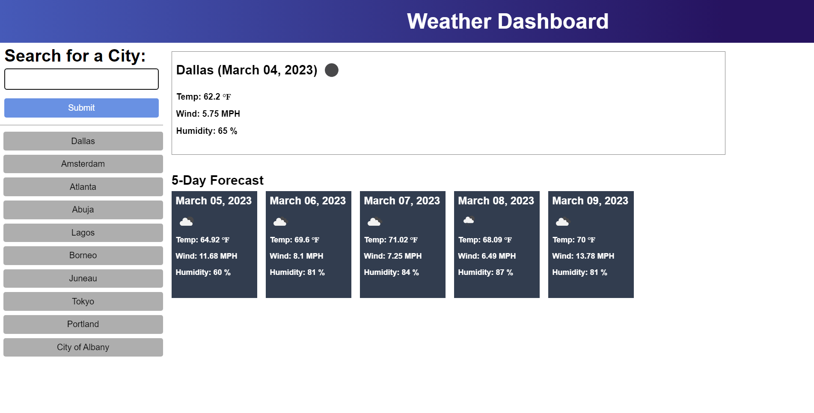

# Weather-Dashboard

## Description

A weather dashboard powered by the third-party API OpenWeather that allows the user to input cities and see the corresponding weather forecast.

## Screenshot

## Usage

Type a city into the searchbar to view the current weather there as well as a five-day forecast. Click on a city in the list on the left to pull up a previously viewed city.

## Credits

N/A

## Link

https://nnamdionyeije.github.io/Weather-Dashboard/
